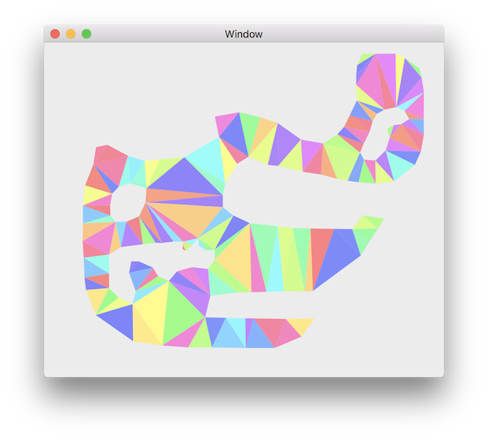
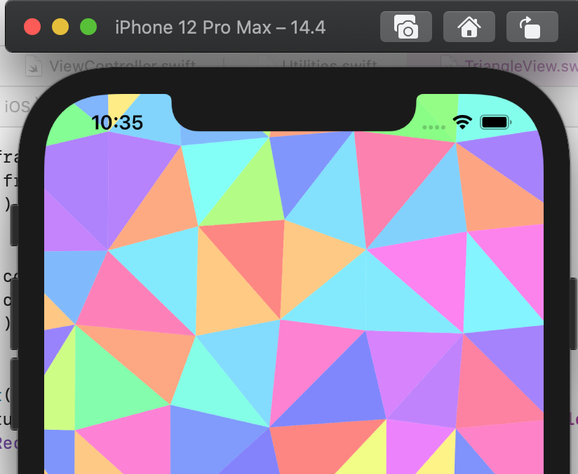

### Delaunay Triangulation
Delaunay Triangulation implementation written with swift [https://en.wikipedia.org/wiki/Delaunay_triangulation](https://en.wikipedia.org/wiki/Delaunay_triangulation)

### Usage

Create array of `Vertex`. 

Using `CDT` vertices must be sorted and validated. I.e. sorted into closed polygon. 
Duplicates will be deleted by internal algorithm.
By default `index` of the `Vertex` is `-1`. For `CDT`, index must be set in same order as in polygon . 

#### Constrained Delaunay Triangulation

`let triangles = CDT().triangulate(vertices, holes)`

Constrained Delaunay Triangulation implemented in the way its utilize Delaunay and then remove trianles for holes and triangles out of constraines. Future improvements can by applied, test triangles before adding them to the list for original Delaunay triangulation process.

#### Simple Delauney
Generate a set of vertices and pass them into `Delaunay().triangulate(vertices)` which will then return the optimal set of triangles.

See the example project for more details.

--
Inspired by [AlexLittlejohn/DelaunaySwift](https://github.com/AlexLittlejohn/DelaunaySwift)
De-fork repository since implementation more then 80% is rewritten and extended greately.

